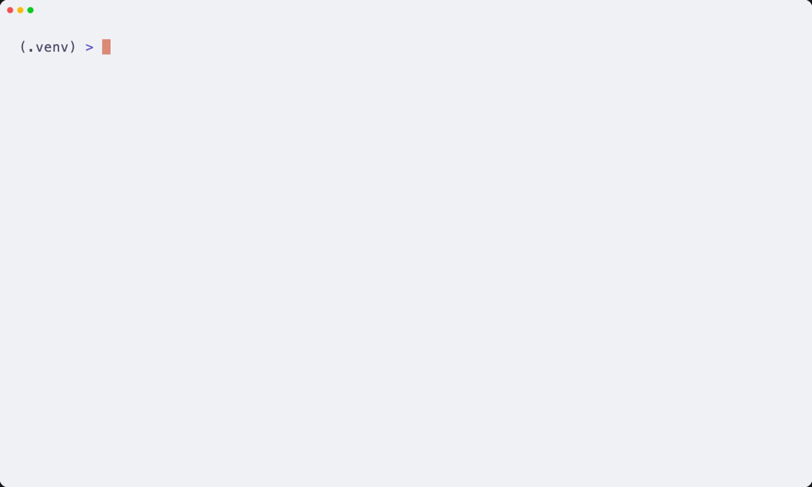

# ScopeCreep

**ScopeCreep** answers one question about a pull request: *does the diff actually do what the title says it does?*

Reviewers are good at spotting bugs and bad at spotting the auth-library swap that rode
along inside "add retry to the webhook sender". ScopeCreep reads the PR's title, body, and
linked issue, throws away the noise nobody reviews anyway (lockfiles, generated output,
reformatting), classifies every remaining group of files as **core**, **supporting**, or
**unrelated**, and rolls that up into a verdict with a drift score. It runs on local
models through [llm-ladder](https://github.com/Ps23102004/llm-ladder)'s confidence-gated cascade, so a review costs
$0.00 and your diff never leaves the machine.



<!-- sample:start -->

```
acme/billing#48  Add retry to the webhook sender
linked issue: #47

GROUP             CHURN        CLASS       REASON
marketing/*.html  +240/-0      UNRELATED   Changes a completely different feature (pricing page) not mentioned in the issue.
src/*.py          +138/-98     core        Directly implements the webhook retry logic (sender.py) and associated utilities.
marketing/*.css   +130/-0      UNRELATED   Modifies the pricing page styling, which is unrelated to the webhook delivery retry mechanism.
tests/*.py        +55/-0       supporting  Tests verifying the functionality of the new webhook sender retry logic.
*.json            +1204/-998   filtered    excluded: lockfile

SCOPE CREEP  —  drift score 68/100
The PR successfully implements the requested webhook retry logic, complete with supporting tests. However, it also introduces a substantial, unrelated pricing page (HTML/CSS) and swaps the authentication library.

Judged in 5 cascade calls on local models — tier 0 held 5/5 calls, $0.00 API spend.
```

<!-- sample:end -->

## Installation

```bash
pip install -e .
```

This pulls [llm-ladder](https://github.com/Ps23102004/llm-ladder) straight from GitHub as
part of the install (see the `dependencies` entry in `pyproject.toml`) — no separate
clone or sibling checkout needed.

### Running tests

```bash
pip install pytest
pytest -m "not network"
```

Every model call and every GitHub call is stubbed — the suite needs neither Ollama nor a
network. Drop the `-m` filter to also run the tests marked `network`.

## Prerequisites

- **[Ollama](https://ollama.com/)** running at `127.0.0.1:11434` with a judge model
  pulled. `chains.yaml` ships pointed at whatever model was on the machine that built
  this repo (currently `gemma4:e2b-mlx`) — you almost certainly don't have that exact
  tag. Set `SCOPECREEP_MODEL=<your tag>` (works for both `check` and `serve`, e.g.
  `SCOPECREEP_MODEL=llama3.2 scopecreep serve`) instead of editing `chains.yaml`.
- **[llm-ladder](https://github.com/Ps23102004/llm-ladder)** — installed automatically by
  `pip install -e .` (it's a git dependency in `pyproject.toml`). ScopeCreep uses its
  cascade as the judge and its ledger as the receipt. It escalates tiers only when the
  small model disagrees with itself, so most groups are settled at tier 0.
- **`GITHUB_TOKEN`** — optional. Public PRs work without one; a token raises the rate
  limit from 60 to 5,000 requests/hour and is required for private repos.

## Usage

```bash
scopecreep check owner/repo#123              # terminal table (default)
scopecreep check owner/repo#123 --json       # machine-readable
scopecreep check owner/repo#123 --md         # markdown, paste into a PR comment
scopecreep check owner/repo#123 --md --out review.md
scopecreep check owner/repo#123 --model llama3.2   # override the judge for one run
scopecreep serve                             # dashboard on http://127.0.0.1:8200
SCOPECREEP_PORT=8300 scopecreep serve        # dashboard on a different port
SCOPECREEP_MODEL=llama3.2 scopecreep serve   # use your own model, not the shipped default
scopecreep readme-sample                     # refresh this README's example block
```

`check` exits 1 with a readable message when the PR can't be fetched — a bad ref, a 404,
or a rate limit that wants `GITHUB_TOKEN` set.

### What gets filtered

A file group is dropped before the judge ever sees it when *every* file in it is a
lockfile, lives under a generated/vendored path (`node_modules`, `dist`, `migrations`,
`*.min.js`, …), or its diff is pure reformatting — added and removed lines match exactly
once whitespace is stripped. One real source file in a directory of generated ones keeps
the whole group in play. Filtered groups still appear in the report, marked `filtered`,
so nothing disappears silently.

## Web

`scopecreep serve` starts a stdlib-only dashboard on `127.0.0.1:8200` — no framework, no
build step, bound to localhost. Paste a PR reference, and the table fills in **row by row
as each file group is classified** rather than blinking once at the end; on a large PR
that's the difference between a progress bar and a spinner.

```
POST /api/check      {"pr": "owner/repo#123"}  -> {"job_id": "..."}
GET  /api/status/{id}                          -> {"state", "progress": [...], "result": {...}}
```

`progress` is an append-only list of `{group, files, adds, dels, classification, reason}`;
poll it and render whatever has arrived. `result` carries `{verdict, drift_score, summary,
ledger, footer}` once `state` is `done` — `footer` is the same measured cost-summary line
(cascade calls, tier-0 hold rate, $ spend) shown at the bottom of the CLI report.

## Why This Exists

Scope creep isn't caught by tests, linters, or type checkers — it passes all of them. It's
caught by a reviewer with enough attention left to notice that a 40-line bugfix touched
`src/auth/`, and by the time a PR is 900 lines of lockfile churn, nobody has that
attention left. This is the one check that reads the title and the diff and asks whether
they're describing the same change.

The whole thing runs on a model small enough to live on your laptop, because "is this file
related to that sentence" is not a frontier-model problem. The footer on every report
tells you exactly what it cost — read straight out of llm-ladder's ledger, never
hardcoded.
